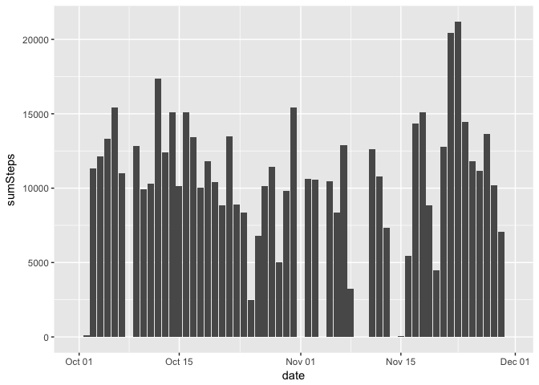
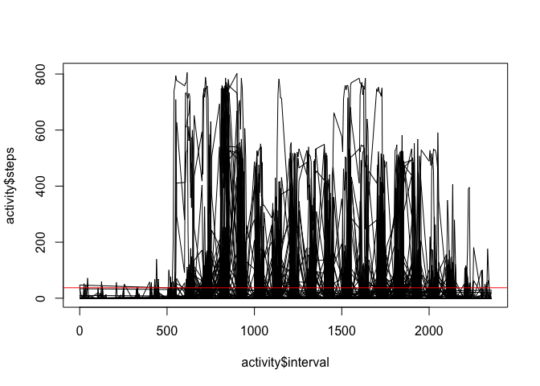
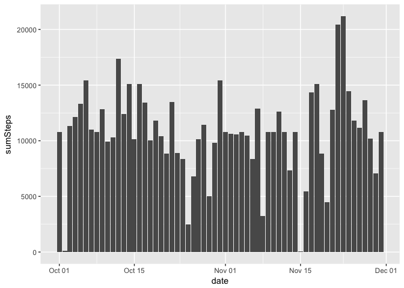
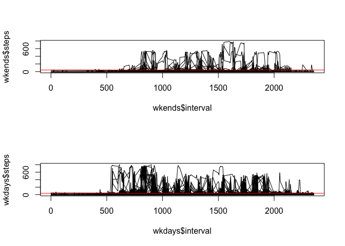

# Reproducible Research: Peer Assessment 1


## Loading and preprocessing the data


```r
activity <- read.csv("activity.csv", header = TRUE)
activity$date <- as.Date(activity$date, format="%Y-%m-%d")
```

```
## Warning in strptime(x, format, tz = "GMT"): unknown timezone 'zone/tz/
## 2017c.1.0/zoneinfo/America/Los_Angeles'
```

## What is mean total number of steps taken per day?


```r
library(plyr)
library(dplyr)
```

```
## Warning: package 'dplyr' was built under R version 3.4.2
```

```
## 
## Attaching package: 'dplyr'
```

```
## The following objects are masked from 'package:plyr':
## 
##     arrange, count, desc, failwith, id, mutate, rename, summarise,
##     summarize
```

```
## The following objects are masked from 'package:stats':
## 
##     filter, lag
```

```
## The following objects are masked from 'package:base':
## 
##     intersect, setdiff, setequal, union
```

```r
sumSteps <- activity %>% group_by(date) %>% summarize(sumSteps = sum(steps, na.rm = T))
library(ggplot2)
ggplot(sumSteps,aes(x=date,y=sumSteps))+geom_bar(stat="identity")
```

<!-- -->

```r
activity %>% group_by(date) %>% summarise( mean=mean(steps, na.rm = T), median=median(steps, na.rm=T))
```

```
## # A tibble: 61 x 3
##          date     mean median
##        <date>    <dbl>  <dbl>
##  1 2012-10-01      NaN     NA
##  2 2012-10-02  0.43750      0
##  3 2012-10-03 39.41667      0
##  4 2012-10-04 42.06944      0
##  5 2012-10-05 46.15972      0
##  6 2012-10-06 53.54167      0
##  7 2012-10-07 38.24653      0
##  8 2012-10-08      NaN     NA
##  9 2012-10-09 44.48264      0
## 10 2012-10-10 34.37500      0
## # ... with 51 more rows
```

## What is the average daily activity pattern?


```r
plot(activity$interval, activity$steps, type="l") 
abline(h=mean(activity$steps, na.rm=T), col="red")
```

<!-- -->
#### Which 5-minute interval, on average across all the days in the dataset, contains the maximum number of steps?


```r
activity %>% summarise( max=max(steps, na.rm = T))
```

```
##   max
## 1 806
```

## Imputing missing values

#### 1. Calculate and report the total number of missing values in the dataset (i.e. the total number of rows with 𝙽𝙰s)


```r
sum(apply(activity, 1, function(z) sum(is.na(z))))
```

```
## [1] 2304
```

#### 2. filling in all of the missing values in the dataset with daily mean

```r
NA2mean <- function(x) replace(x, is.na(x), mean(x, na.rm = TRUE))
activity <- replace(activity, TRUE, lapply(activity, NA2mean))
sumSteps <- activity %>% group_by(date) %>% summarize(sumSteps = sum(steps, na.rm = T))
```

#### Make a histogram of the total number of steps taken each day


```r
ggplot(sumSteps,aes(x=date,y=sumSteps))+geom_bar(stat="identity")
```

<!-- -->

#### Calculate and report the mean and median total number of steps taken per day


```r
activity %>% group_by(date) %>% summarise( mean=mean(steps, na.rm = TRUE), median=median(steps, na.rm = TRUE))
```

```
## # A tibble: 61 x 3
##          date     mean  median
##        <date>    <dbl>   <dbl>
##  1 2012-10-01 37.38260 37.3826
##  2 2012-10-02  0.43750  0.0000
##  3 2012-10-03 39.41667  0.0000
##  4 2012-10-04 42.06944  0.0000
##  5 2012-10-05 46.15972  0.0000
##  6 2012-10-06 53.54167  0.0000
##  7 2012-10-07 38.24653  0.0000
##  8 2012-10-08 37.38260 37.3826
##  9 2012-10-09 44.48264  0.0000
## 10 2012-10-10 34.37500  0.0000
## # ... with 51 more rows
```

## Are there differences in activity patterns between weekdays and weekends?

#### 1. Create a new factor variable in the dataset with two levels – “weekday” and “weekend” indicating whether a given date is a weekday or weekend day.


```r
library(chron)
activity$weekday <- factor(is.weekend(activity$date), labels = c("weekday", "weekend"))
wkdays <- activity[activity$weekday=="weekday",]
wkends <- activity[activity$weekday=="weekend",]

library(lattice)
par(mfrow=c(2,1))
plot(wkends$interval, wkends$steps, type='l')
abline(h=mean(wkends$steps, na.rm=T), col="red")
plot(wkdays$interval, wkdays$steps, type='l')
abline(h=mean(wkdays$steps, na.rm=T), col="red")
```

<!-- -->
